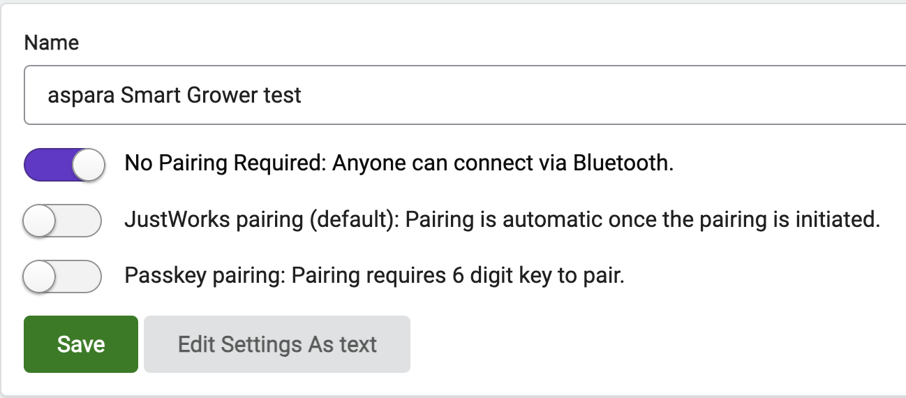
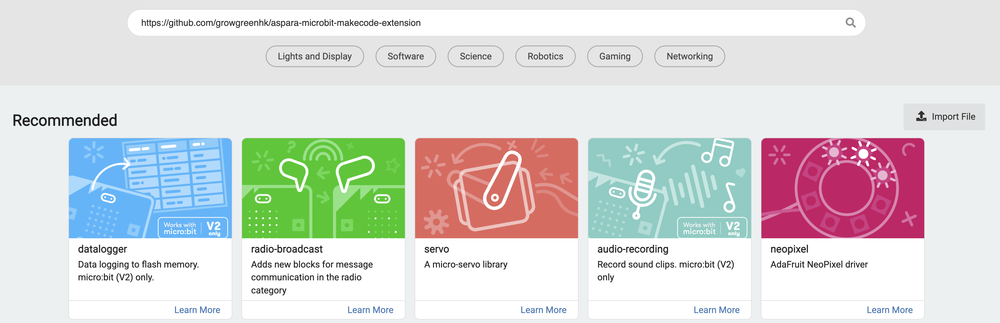
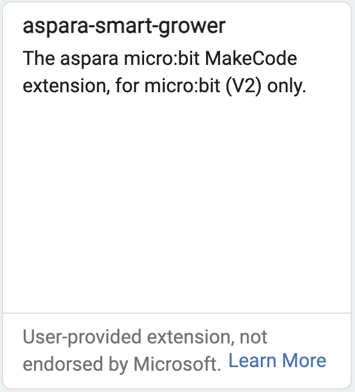

# aspara micro:bit MakeCode Extension
This is the micro:bit MakeCode Extension for controlling the aspara Smart Grower by [Growgreen Limited](https://www.grow-green.com/)

## How to add aspara micro:bit MakeCode Extension to your MakeCode project

* Create/Open a MakeCode project using the micro:bit MakeCode Editor at https://makecode.microbit.org
* Click the cog icon in the top right, then select <I> "Project Settings"</I>

    

* Enable the <I><U>"No Pairing Required: Anyone can connect via Bluetooth."</U></I> and <I>"Save"</I>

    

* In the web editor, click on <I>"Extensions"</I> to add extensions to the project

    

* Enter "<I><B>https://github.com/ggstephenlau/aspara-stylist</B></I>" and search

    

* Select the aspara micro:bit MakeCode Extension from the search results.

    

* Select <I>"Remvoe extension(s) and add aspara-stylist"</I> if a pop-up appears with the message <I>"Some extensions will be removed"</I>

    

* <I>"aspara Stylist"</I> will show up in the editor and be ready to use.

    

## How to use the extension
### On start - assign an unique microbit ID for the project
* Add <I><U>"start aspara Stylist service with microbit ID"</U></I> from the aspara Stylist extension to the block <I><U>"on start"</U></I>
* Enter an ID for this project.
* E.g.

    
### Control blocks
* Set LED (red/blue/white) lights intensity (0 - 100)%

    

* Set front panel indicators (8 indicators) on/off

    

* Set pump on/off

    
    
* Play a short/long beep sound

    

### Value blocks
* (red/blue/white) LED intensity (0 - 100)%

    

* Indicators (1 - 8) state (on / off)

    

* Pump state (on / off)

    

* Room temperature (°C) from wireless planting sensor

    
    
* Relative humidity (%) from wireless planting sensor

    

* Light intensity (Lux) from wireless planting sensor

    

* Nutrient level (μS/cm) from wireless planting sensor.

    

* Battery level from wireless planting sensor

    

* Real time clock (year, month, day, hour, minute, second)

    

## Setup
* Assign an unique micro:bit ID for this project.
* Download and Run the project.
* Use the aspara STEM app to pair the aspara Smart Grower and aspara Wireless Planting Sensor with the micro:bit.

## Sample micro:bit projects using aspara Stylist extension
### Following are aspara Stylist microbit projects which could be imported to the microbit makecode editor for demo purposes.
* <I><B>https://github.com/ggstephenlau/aspara-stylist/example/aspara-simple-demo</B></I>
* <I><B>https://github.com/ggstephenlau/aspara-stylist/example/aspara-demo</B></I>
* <I><B>https://github.com/ggstephenlau/aspara-stylist/example/aspara-planting-demo</B></I>

