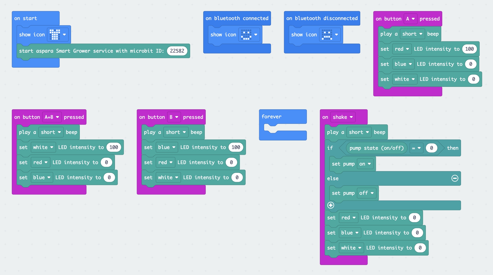

## Introduction
* To demo the use of the control blocks of the <B>aspara Smart Grower</B> MakeCode extension.

    
## Control actions
* Press the "A" button would turn on the "RED" led light.
* Press the "B" button would turn on the "BLUE" led light.
* Press the "A+B" button would turn on the "WHITE" led light.
* Shack the micro:bit would off all led lights and toggle the pump on/off states.

## Compatibility

* Works with <B>micro:bit V2</B> hardware only
