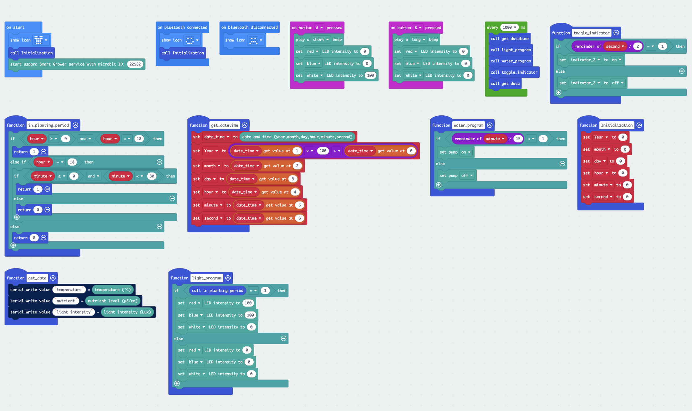

## Introduction
* It's a demo to run a full aspara Smart Grower planting program, which woud schedule the LED lights on/off time, and the pattern of the pump on/off.
* In the below example program, the LED light would be turned on from 7:00 to 17:30, and the pump would be turn on for 1 minute every 15 minute.

## Example program

## Compatibility

* Works with <B>micro:bit V2</B> hardware only
